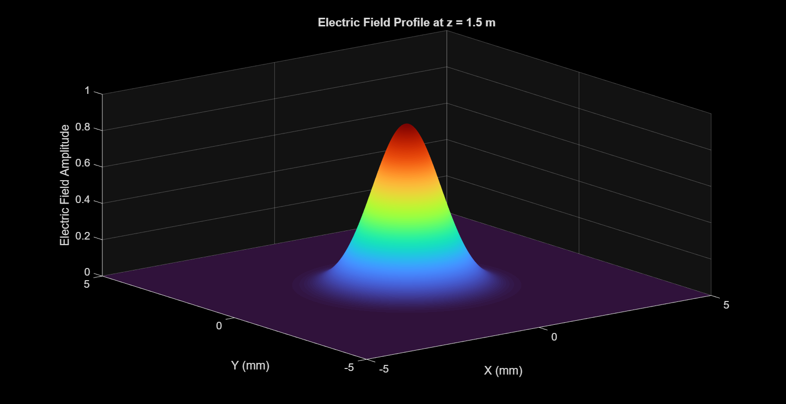
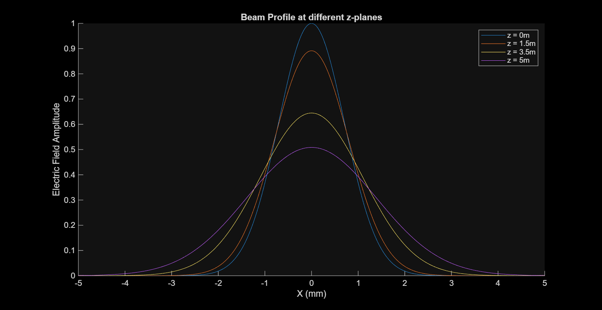
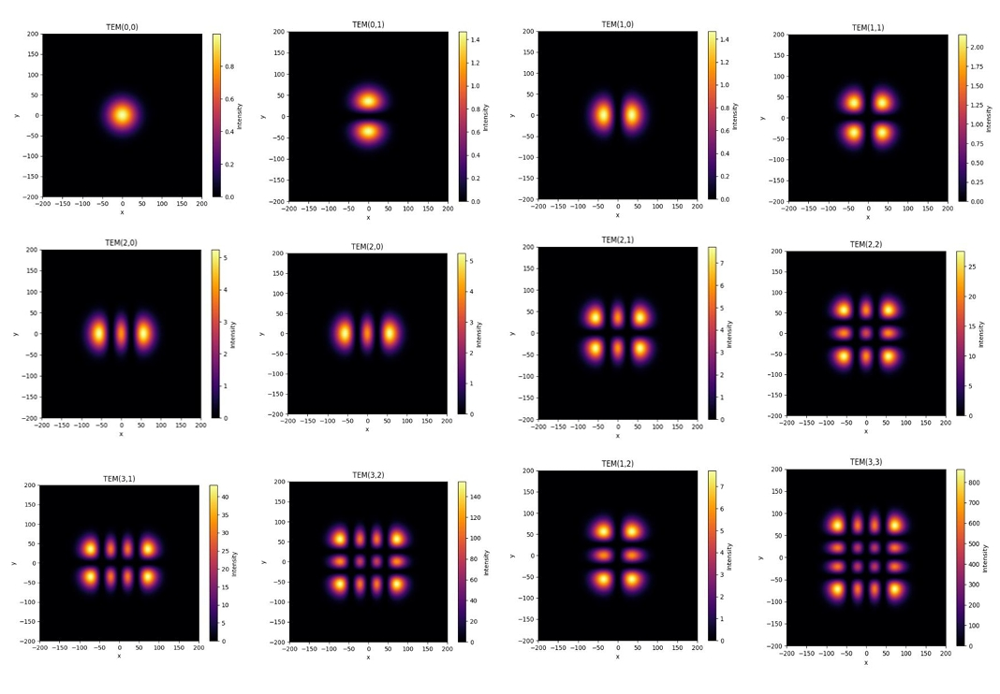

# Gaussian-Beam-Electric-Field-Visualisation
This MATLAB code displays how the beam width changes with its propagation with the help 
of angular spectrum method.

This simulation is done by taking an initial Gaussian Electric Field, then discretising it into a 500 x 500 grid, with sampling interval of 20 micrometer. After taking Fourier Transform of the given field into its frequency domain, we applied paraxial approximation as the beam propagates and get the final beam profile at our desired z-planes after taking the inverse Fourier Transform.

# Hermite-Gaussian-Beam-Mode-Visualisation
Gaussian and Hermite–Gaussian beam simulation, visualization, and mode analysis in Python.

